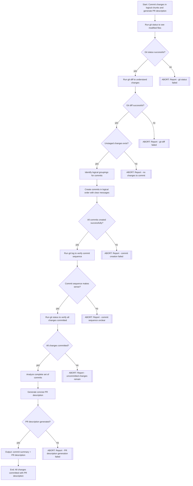

# Task: Commit All Changes in Logical Chunks and Generate PR Description

This command MUST delegate to the committer sub-agent with the visual plan and instructions below.

## Delegation Instructions

Delegate to committer with the following visual plan and task description:

### Visual Implementation Plan

### Task Description for committer

Commit all unstaged changes in the repository in small, logical chunks that make it easy for a reviewer to follow the implementation story, then generate a PR description.

**Requirements**:

1. **Understand the Changes**
   - Run `git status` to see all modified files (ABORT if fails)
   - Run `git diff` to understand the nature of changes (ABORT if fails)
   - Verify unstaged changes exist (ABORT if none)
   - Identify logical groupings (infrastructure, features, tests, etc.)

2. **Create Logical Commits**
   - Group related changes together:
     - Infrastructure changes (base classes, shared code)
     - Per-API changes (if multiple APIs affected, separate commits per API)
     - Database migrations (separate commit for schema changes)
     - Feature implementation (core business logic)
     - Supporting changes (helpers, utilities)
     - Test updates (grouped by test suite)

3. **Commit Guidelines**
   - Use `git add <specific-files>` to stage only related files
   - Write clear, concise commit messages:
     - Use imperative mood: "Add feature" not "Added feature"
     - Keep subject lines under 50 characters
     - Subject only (no body) unless absolutely necessary
     - Focus on WHAT changed, not which files (git shows files)

4. **Commit Order**
   - Commit in logical dependency order:
     1. Infrastructure/foundation changes first
     2. Database migrations
     3. Core feature implementation
     4. Supporting code that uses the feature
     5. Test updates last

 5. **Generate PR Description**
   - After all commits are created (ABORT if any commit failed)
   - Verify commit sequence makes sense with `git log` (ABORT if unclear)
   - Verify all changes committed with `git status` (ABORT if uncommitted changes remain)
   - Analyze the complete set of commits
   - Write a concise PR description focusing on:
     - WHY the changes were made
     - Key technical decisions
     - Important notes for reviewers
     - Security or breaking changes (if any)
   - Keep it short and skimmable
   - Use bullet points
   - Do NOT list changed files (redundant)

6. **Output Format**
   - Summary of commits created (count and brief descriptions)
   - The PR description in markdown format
   - Confirmation that all changes are committed (`git status` clean)

**Important Notes**:
- These commits will be squash-merged, so focus on reviewer clarity over strict compile-at-every-commit
- Err on the side of smaller, focused commits rather than large commits
- Each commit should have a clear single purpose
- Group by logical concern, not by file type
- Use `git log --oneline --reverse origin/main..HEAD` to verify commit sequence makes sense

Follow the visual plan above. At each decision point (diamond), verify the condition.
If ANY condition fails, STOP immediately and report back with the ABORT message.
