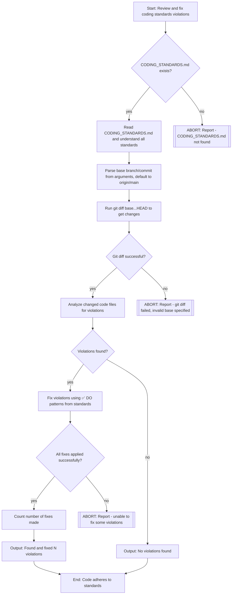

# Task: Fix Code to Adhere to Coding Standards

If using orbit and it is configured with a 'self-review' waypoint: use orbit-cli to reach the 'self-review' waypoint.

This command MUST delegate to the expert-coder sub-agent with the visual plan and instructions below.

## Delegation Instructions

Delegate to expert-coder with the following visual plan and task description:

### Visual Implementation Plan

### Task Description for expert-coder

Review code changes (both committed and uncommitted) and fix any violations of coding standards documented in CODING_STANDARDS.md.

**Base branch/commit**: Parse from arguments: $ARGUMENTS
- Look for patterns like "vs branch-name", "against branch-name", "from commit-hash"
- Default to `origin/main` if not specified

**Additional context**: $ARGUMENTS (may contain focus areas beyond base specification)

**Requirements**:
1. Check if CODING_STANDARDS.md exists in repository root (ABORT if not found)
2. Read and understand all documented standards
3. Run `{ git diff main...HEAD --name-only; git diff --cached --name-only; git diff --name-only; } | sort -u` to identify all changes (committed and uncommitted)
4. Review all changes for violations of standards (focus on ❌ NEVER and ❌ DO NOT patterns)
5. Fix violations using the ✅ DO patterns from the standards
6. Focus on actual violations, not nitpicking
7. Output only: "Found and fixed N violations" OR "No violations found"

**CRITICAL**: 
- This is a utility command, NOT a workflow milestone
- DO NOT commit changes
- DO NOT push changes  
- DO NOT create PRs
- DO NOT treat this as "task complete"
- Just fix violations and report the count

Follow the visual plan above. At each decision point (diamond), verify the condition.
If ANY condition fails, STOP immediately and report back with the ABORT message.

## Examples

- `/self-review` - Reviews and fixes changes vs origin/main
- `/self-review vs develop` - Reviews and fixes changes vs develop branch
- `/self-review from abc123def` - Reviews and fixes changes from commit
- `/self-review vs develop focus on SQL queries` - Reviews vs develop with focus
