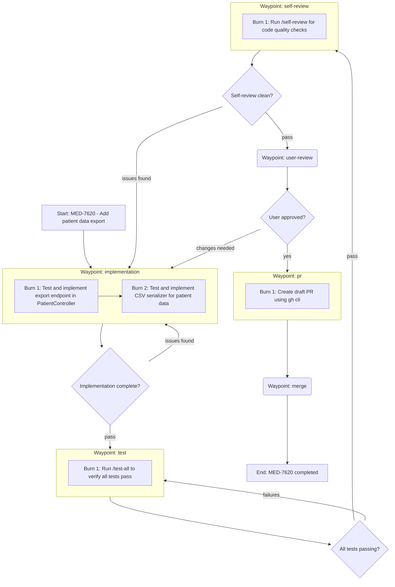

GOAL
Create a trajectory plan for the orbit using a Mermaid flowchart structured around waypoints and burns. DO NOT write or suggest any code yet.

WORKFLOW (follow in order)
1. ASSESS - Check for an existing plan
   - Run `orbit show` to understand current orbit state
   - Check if trajectory already exists with `orbit trajectory view`
   - If trajectory exists: review it and proceed with execution
   - Read the Linear issue or task description
   - Check: does the issue already contain a visual plan, implementation steps, or a breakdown of work?
   - If YES: adopt the existing plan. Convert it into a trajectory diagram (waypoints + burns). Proceed to step 3.
   - If NO: proceed to step 2.

2. DISCOVER - Only when no plan exists
   - Explore relevant code/docs/context as needed
   - Identify unknowns, ambiguities, and decisions that need user input
   - Ask ALL clarifying questions in a single message
   - WAIT for user responses before proceeding

3. PLAN - Create and save the trajectory diagram
   - Whether adopting an existing plan or creating a new one, output EXACTLY two parts:
     (1) a Mermaid diagram structured around waypoints and burns
     (2) 3-5 bullet points summarizing the trajectory
   - If adopting an existing plan, the bullets should note this: "Trajectory derived from plan in issue description"
   - The bullets summarize the COMPLETED plan, they do NOT ask questions
   - After displaying the plan, save it by passing the diagram via stdin using heredoc syntax (do NOT save to a file first):
     orbit trajectory plot <orbit-id> <<'EOF'
     ```mermaid
     [your diagram]
     ```
     EOF

HARD RULES
- Do NOT implement, draft code, propose patches, or include file contents. Planning only.
- Do NOT schedule or register burns - this skill is for trajectory planning only.
- The final plan output must contain EXACTLY two parts and NOTHING ELSE:
  (1) a single Mermaid code block
  (2) exactly 3-5 bullet points summarizing the trajectory
- No preface, no extra headings, no extra paragraphs, no checklists, no "next steps" outside the bullets.

BURN SIZING
- Burns must be aggressively small.
- If there is any doubt, split the work into smaller burns.
- Do not optimize for fewer burns.
- Do not group work just because it feels cohesive.
- Over-splitting is preferred; under-splitting is a mistake.
- Each burn should be one narrow behavior slice — not multiple independent changes combined.
- If a burn description uses "and" between independent actions, split it into separate burns.
- Each implementation burn follows TDD: write tests before the code they test, not after. A burn may contain multiple red -> green cycles. Tests and the implementation they verify must be in the same burn — never split across separate burns.
- A too-small burn has near-zero cost; a too-large burn causes aborts, rework, and poor results.

MERMAID REQUIREMENTS
- Use: flowchart TD
- DO NOT use quoted labels (no ["..."] or subgraph X["..."])
- All node and subgraph labels MUST be unquoted plain text
- Start node label: Start: <orbit-id> - <brief task summary>   (no quotes)
- End node label: End: <orbit-id> completed                    (no quotes)
- Structure the diagram around WAYPOINTS and BURNS:
  - Use subgraphs for waypoints that contain burns
  - Use nodes for individual burns within waypoint subgraphs
  - Waypoints without burns (user-review, user-test) are single nodes
  - Connect waypoints sequentially
  - Include decision diamonds between waypoints for pass/rollback decisions
- Use shapes:
  - Burns/action steps: [like this]
  - Pass/rollback decisions: {like this}
  - Waypoints without burns: (like this)
- Every decision must have labeled edges (pass/rollback or yes/no).
- Keep nodes implementation-oriented (what to do), not narrative.
- Only include waypoints that are relevant to this orbit. Skip waypoints that have already been passed.

BULLET REQUIREMENTS (exactly 3-5 bullets)
- Bullets summarize: key design decisions, approach chosen, and any accepted tradeoffs.
- These are statements about the plan, NOT questions or requests for confirmation.
- No additional formatting besides simple "-" bullets.

EXAMPLE OUTPUT



- Export endpoint follows existing PatientController patterns, returns CSV with configurable delimiter
- CSV serializer handles Unicode and special characters per RFC 4180
- Each implementation burn follows TDD: tests written before production code within the same burn
- Test waypoint runs all tests as QA gate before self-review
- Rollback paths loop back to implementation if issues are found in test or self-review

Note: This example uses few burns for brevity. Apply the BURN SIZING rules above to determine the correct granularity for your trajectory.
