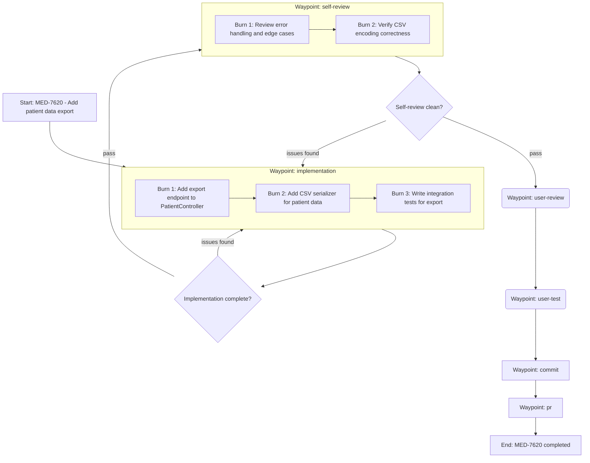

GOAL
Create a trajectory plan for the orbit using a Mermaid flowchart structured around waypoints and burns + a short summary. DO NOT write or suggest any code yet.

WORKFLOW (follow in order)
1. ASSESS - Check for an existing plan
   - Run `orbit show <id>` to understand current orbit state
   - Read the Linear issue or task description
   - Check: does the issue already contain a visual plan, implementation steps, or a breakdown of work?
   - If YES: adopt the existing plan. Convert it into a trajectory diagram (waypoints + burns). Skip to step 3.
   - If NO: proceed to step 2.

2. DISCOVER - Only when no plan exists
   - Explore relevant code/docs/context as needed
   - Identify unknowns, ambiguities, and decisions that need user input
   - Ask ALL clarifying questions in a single message
   - WAIT for user responses before proceeding

3. PLAN - Create the trajectory diagram
   - Whether adopting an existing plan or creating a new one, output EXACTLY two parts:
     (1) a Mermaid diagram structured around waypoints and burns
     (2) 3-5 bullet points summarizing the trajectory
   - If adopting an existing plan, the bullets should note this: "Trajectory derived from plan in issue description"
   - The bullets summarize the COMPLETED plan, they do NOT ask questions

4. REGISTER - Only after user approves
   - Register all burns in orbit: `orbit burn add <id> "description"` for each burn
   - This happens AFTER approval, never before

HARD RULES
- If the issue already contains a plan, adopt it. Do not redo discovery for work that's already been planned.
- If no plan exists, do NOT create the diagram until all critical questions are answered.
- Do NOT implement, draft code, propose patches, or include file contents. Planning only.
- Do NOT begin implementation until the user explicitly approves the trajectory.
- Do NOT register burns in orbit until the trajectory is approved.
- The final plan output must contain EXACTLY two parts and NOTHING ELSE:
  (1) a single Mermaid code block
  (2) exactly 3-5 bullet points summarizing the trajectory
- No preface, no extra headings, no extra paragraphs, no checklists, no "next steps" outside the bullets.
- Bullets are a SUMMARY of decisions made, NOT questions or open items.

MERMAID REQUIREMENTS
- Use: flowchart TD
- DO NOT use quoted labels (no ["..."] or subgraph X["..."])
- All node and subgraph labels MUST be unquoted plain text
- Start node label: Start: <orbit-id> - <brief task summary>   (no quotes)
- End node label: End: <orbit-id> completed                    (no quotes)
- Structure the diagram around WAYPOINTS and BURNS:
  - Use subgraphs for waypoints that contain burns
  - Use nodes for individual burns within waypoint subgraphs
  - Waypoints without burns (user-review, user-test) are single nodes
  - Connect waypoints sequentially
  - Include decision diamonds between waypoints for pass/rollback decisions
- Use shapes:
  - Burns/action steps: [like this]
  - Pass/rollback decisions: {like this}
  - Waypoints without burns: (like this)
- Every decision must have labeled edges (pass/rollback or yes/no).
- Keep nodes implementation-oriented (what to do), not narrative.
- Only include waypoints that are relevant to this orbit. Skip waypoints that have already been passed.

BULLET REQUIREMENTS (exactly 3-5 bullets)
- Bullets summarize: key design decisions, approach chosen, and any accepted tradeoffs.
- These are statements about the plan, NOT questions or requests for confirmation.
- No additional formatting besides simple "-" bullets.

EXAMPLE OUTPUT

- Export endpoint follows existing PatientController patterns, returns CSV with configurable delimiter
- CSV serializer handles Unicode and special characters per RFC 4180
- Integration tests cover happy path, empty results, and malformed query parameters
- Self-review specifically targets encoding edge cases identified during refinement
- Rollback paths from self-review loop back to implementation if issues are found
