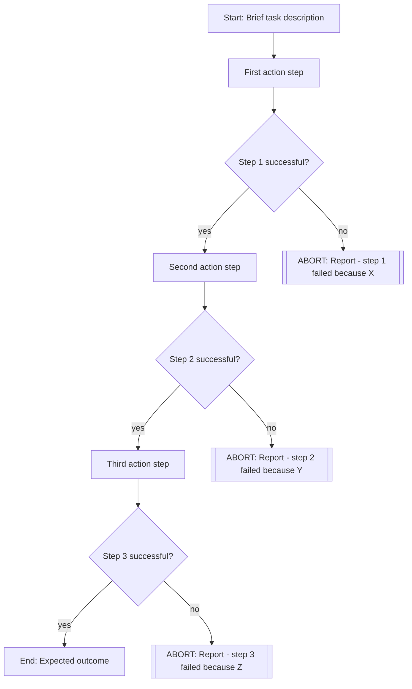
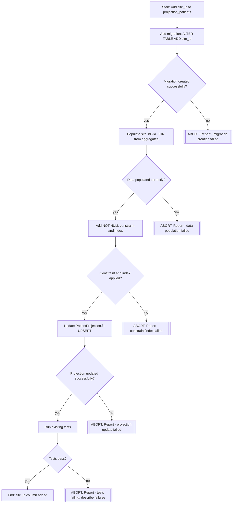

GOAL
Create a Mermaid flowchart implementation plan for delegating to a sub-agent. The plan must include clear decision points with "exit ramps" - paths where the sub-agent should STOP and report back to the manager rather than attempting to solve unexpected issues on its own.

WHEN TO USE
- Before delegating implementation work to expert-coder or other sub-agents
- For any task that has potential failure modes or requires specific conditions to be met
- When you want the sub-agent to abort early if assumptions don't hold

SCOPE CHECK - BEFORE BUILDING THE DIAGRAM

This diagram represents ONE delegation to ONE sub-agent. This SHOULD be a SMALL step in your full plan, DO NOT delegate your full plan to one sub-agent.
Each delegated visual-task diagram should address a single concern with 3-8 action steps.

Before building the diagram, check: does your planned task combine
independent concerns? Examples of independent concerns:
- Core logic changes vs call-site updates
- Production code vs test updates  
- Different modules that don't depend on each other's changes
- Validation logic vs API endpoints that use it

If yes, STOP and create separate diagrams for each concern.

A task CAN touch many files if the change is mechanical and uniform
(e.g., updating a type signature propagated across 50 call sites).
The key question: does it require making independent design decisions
about separate concerns? If yes, split it.

MERMAID SYNTAX



NODE SHAPES
- Actions/steps: [square brackets]
- Decisions/conditions: {curly braces}
- ABORT points: [[double brackets]] - sub-agent must stop and report back
- End states: [square brackets]

CRITICAL RULES

1. EVERY action step MUST be followed by a decision diamond
   - Pattern: `Step[Do X] --> Check{X successful?}`
   - This is mandatory - no chains of action steps without verification
   - BAD: `Step1 --> Step2 --> Step3` (no verification)
   - GOOD: `Step1 --> Check1{OK?} --> Step2 --> Check2{OK?} --> Step3`

2. Every decision diamond MUST have TWO paths:
   - `-->|yes|` continues to next step (success path)
   - `-->|no|` leads to an ABORT node (failure path)

3. ABORT nodes must be labeled clearly:
   - `[[ABORT: Report - <specific reason>]]`
   - Examples:
     - `[[ABORT: Report - migration failed to apply]]`
     - `[[ABORT: Report - expected file not found]]`
     - `[[ABORT: Report - tests failing after change]]`

OUTPUT FORMAT
Include the mermaid diagram in your delegation prompt to the sub-agent:

```
Follow this implementation plan. At each decision point (diamond), verify the condition.
If ANY condition fails, STOP immediately and report back with the ABORT message from that decision point.

[mermaid diagram here]
```


EXAMPLE - Adding a database column with projection update


